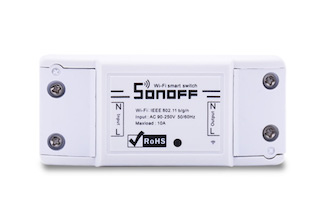
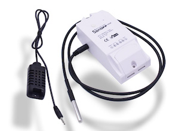
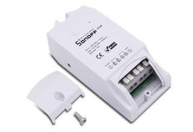
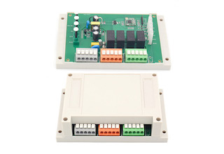
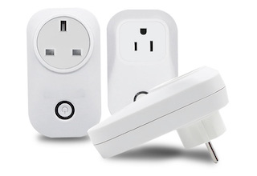

# ITEAD Smart Home
## Alternative firmwares for [itead.cc](http://sonoff.itead.cc/) Sonoff products
This repository offers alternative and open-source firmwares for iTead Sonoff products, based on the MQTT protocol and are natively compatible with [Home Assistant](https://home-assistant.io), which is a amazing open-source home automation platform. 

| Product       | Presentation                                                          | Firmware                | Preview                      |
|---------------|-----------------------------------------------------------------------|-------------------------|-------------------------------
| Sonoff Basic  | [itead.cc](http://sonoff.itead.cc/en/products/sonoff/sonoff-basic)    | [GitHub](Sonoff_Basic/) |   |
| Sonoff TH     | [itead.cc](http://sonoff.itead.cc/en/products/sonoff/sonoff-th)       | [GitHub](Sonoff_TH/)    |      |
| Sonoff Pow    | [itead.cc](http://sonoff.itead.cc/en/products/sonoff/sonoff-pow)      | -                       |     |
| Sonoff 4CH    | [itead.cc](http://sonoff.itead.cc/en/products/sonoff/sonoff-4ch)      | -                       |     |
| S20 Socket    | [itead.cc](http://sonoff.itead.cc/en/products/residential/s20-socket) | -                       |     |

*If you like the content of this repo, please add a star! Thank you!*
