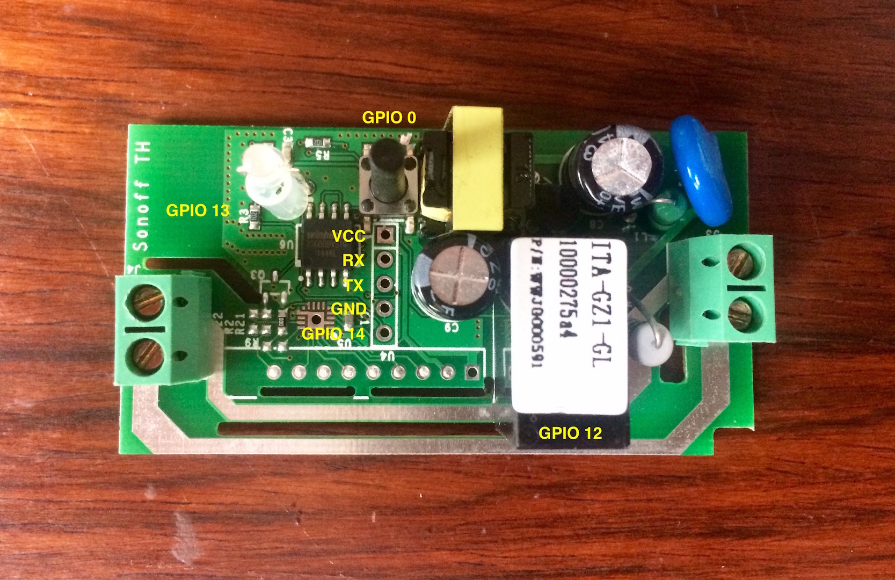

# Sonoff
Alternative firmware for Sonoff switches, based on the MQTT protocol.
Sonoff is a small ESP8266 based module, that can toggle mains power and costs only $4.85. More information can be found [here](https://www.itead.cc/sonoff-wifi-wireless-switch.html).

## Features
- Wi-Fi credentials configuration using WiFiManager
- Web configuration portal to setup MQTT username, password, broker IP address and port
- OTA firmware update
- Onboard button:
  - Toggle the state of the relay
  - Restart the relay (hold pressed 3 seconds)
  - Reset the relay (hold pressed 5 seconds)

## Steps
- Connect the Sonoff to a FTDI adapter and hold down the button, while powering it (programing mode)
- Upload the firmware with the Arduino IDE
- Connect to the new Wi-Fi AP and memorize its name (1)
- Select `Configure WiFi`(2)
- Choose your network (3) and enter your MQTT username, password, broker IP address and broker port (4)
- Update your configuration in Home Assistant, with :
  - `state_topic: <WIFI_AP_NAME>/switch/state`
  - `command_topic: <WIFI_AP_NAME>/switch/switch`


## Schematic
- VCC (Sonoff) -> VCC (FTDI)
- RX  (Sonoff) -> TX  (FTDI)
- TX  (Sonoff) -> RX  (FTDI)
- GND (Sonoff) -> GND (FTDI)



## Configuration (Home Assistant)
configuration.yaml :

```yaml
switch:
  platform: mqtt
  name: 'Switch'
  state_topic: 'CBF777/switch/state'
  command_topic: 'CBF777/switch/switch'
  optimistic: false
```
